# Wifi-Client-y-Ap
Este es un repositorio para la documentacion de Wifi Client y Ap

Integrantes:
Camilo Coral 
Linda Castillo
Diana Leonela
Andrea Arteaga

## Pasos para configurar Wifi-Client-y-Ap

1. Para configurar el gatwey, equipo local y mascara ingresamos por el panel de control y nos ubicamos en la siguiente ruta 
 
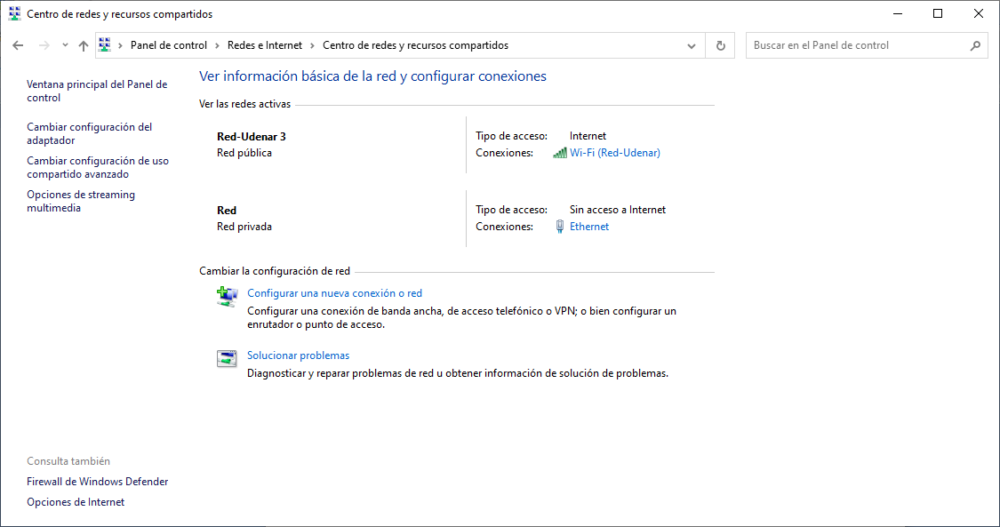

2.	Luego ingresamos en cambiar configuración del adaptador

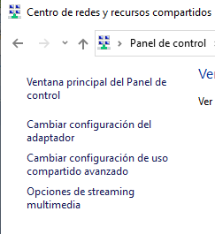

3.	Luego seleccionamos el adaptador puente y luego propiedades

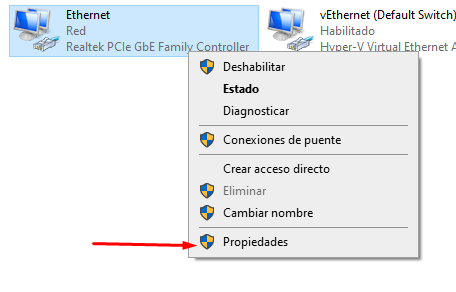
 
4.	Seleccionamos el protocolo donde vamos a modificar la dirección de red y seleccionamos propiedades.
 
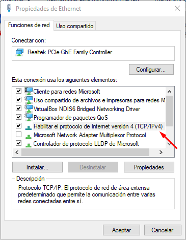

5. cambiamos la dirección local, mascara y Gateway

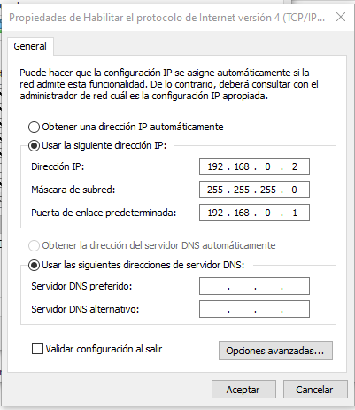
 
6. Para hacer ping tenemos que conectar el router con nuestro pc con un cable de red

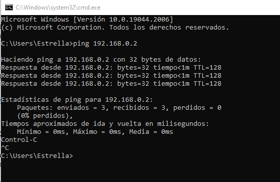
 
7. Ahora hacer ping en el Gateway pero primero hay que reiniciar el router para que tome la dirección ip del Gateway.

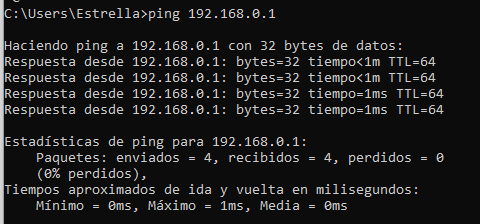
 
8. ahora acceder en el navegador para configurar nuestro router accespoint en la pagina de  mi router tp- link
 
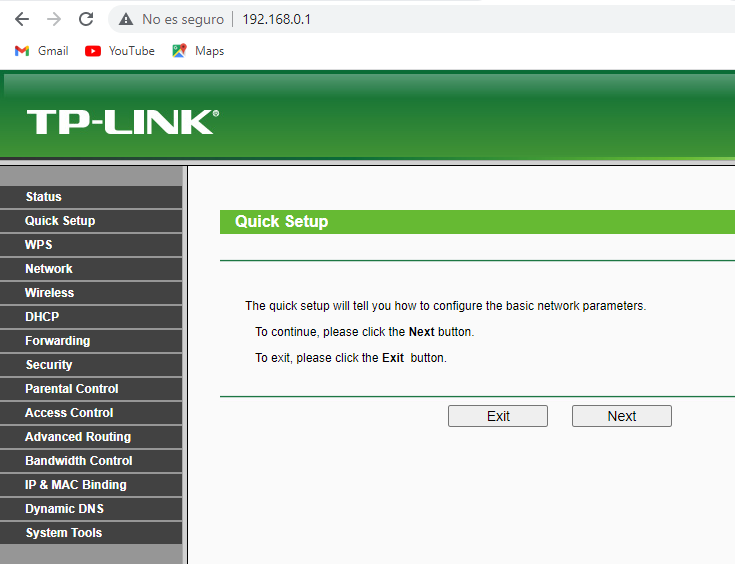

9. verificar que la dirección del Gateway este en la pagina tp-link

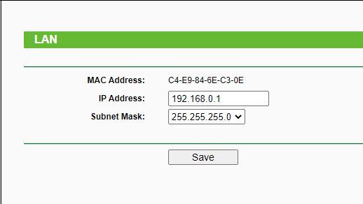
 
10. Verificar que la seguridad inalámbrica este bien configurada

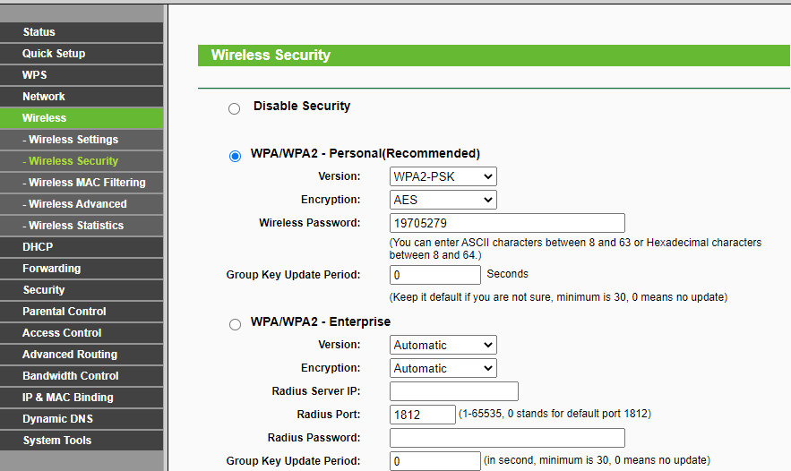

11. Ahora deshabilitar el dhcp para que solo se conecte con el router

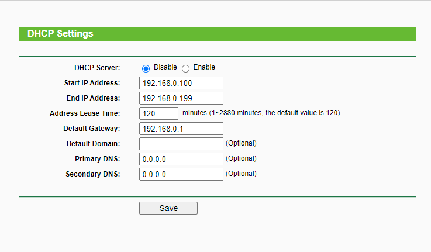
 
12. Ahora reiniciar el router.

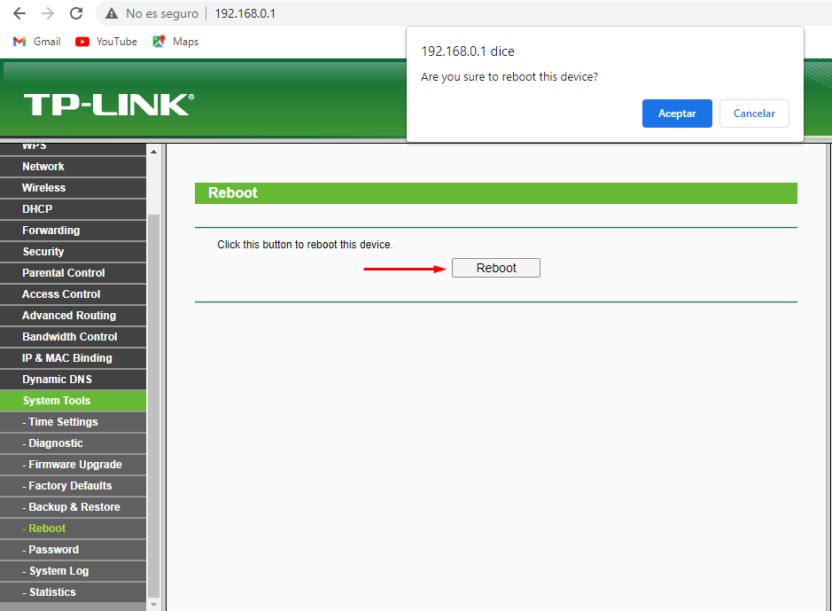 

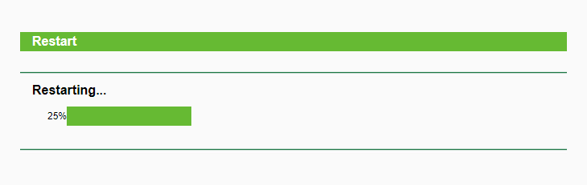

Y ahora si podremos tener conexión tanto en el cable como en la red inalámbrica.

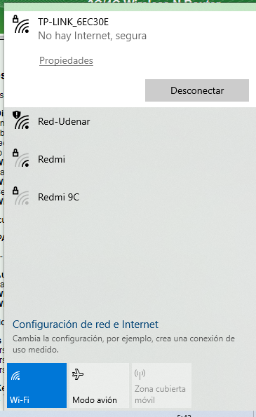
